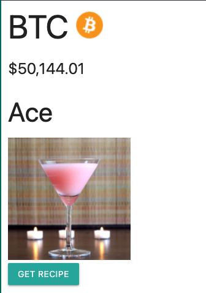

# crypto-cocktails

## Descripton
This repository contains the code for a deployed web app that fetches cocktail recipes and current cryptocurrency prices and icons

## Table of Contents
* [Contact](#contact)
* [Technologies](#technologies)  
* [Instructions](#instructions)

## Contact
Matthew Brignola matthewbrignola@ymail.com 
Jenya Seletsky js646@me.com
Stephen Moore jufo2000@comcast.net
Andrew McInally ihaveandybodies@gmail.com
## Technologies
  HTML
   CSS
   JavaScript
   jQuery
    [jQuery UI](https://jqueryui.com/)
     [Materialize CSS](https://materializecss.com/) 
## Instructions
1. Type a letter in a cryptocurrency name that you would like to see the prices of in the "Search" bar  

2. You will then see a list of cryptocurrencies with the letter you types in them  

3. Select the coin you want to see the prices for in the dropdown menu
4. Click enter or press "Search"
5. In the center of the screen you will see the Price information for the coin you selected (if your coin choicer is in the top 100 coins there will also be a image of the coin displayed)
 
6. Underneath the coin info a random alcoholic beverage will be displayed 
7. Click the "Get Recipe" button and  a modal will appear with the recipe
 
8. Once you search, a button will be created with the name of the currency you selected  
 
9. If you click this button it will display the price info for the coin on the button
10. You can click the red "X" button to remove a coin from the history

